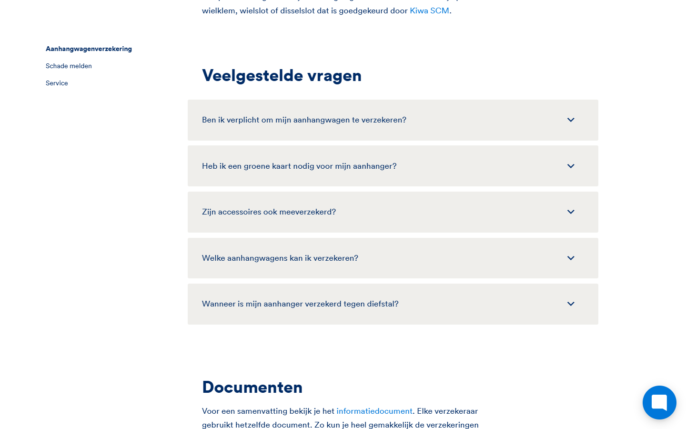
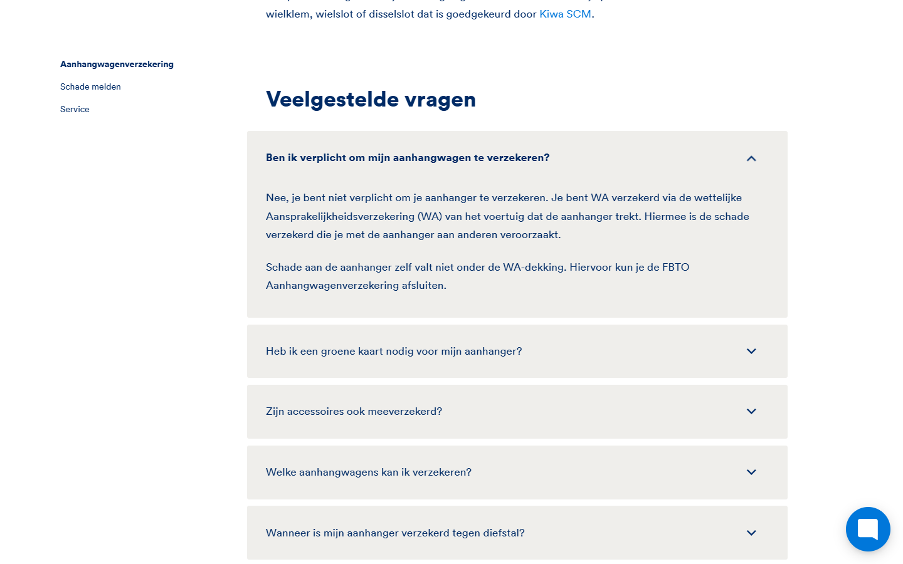
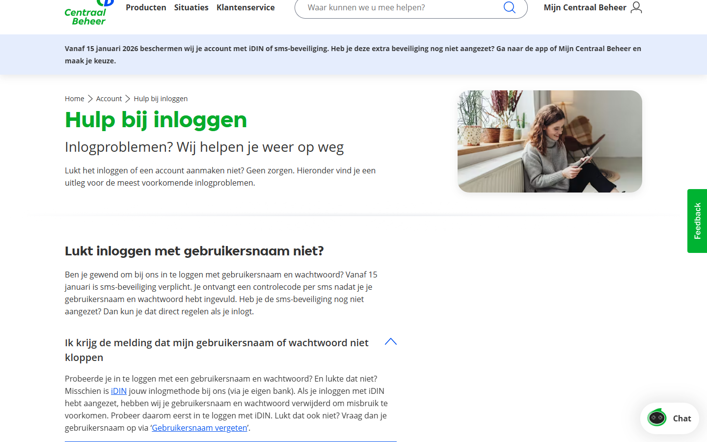
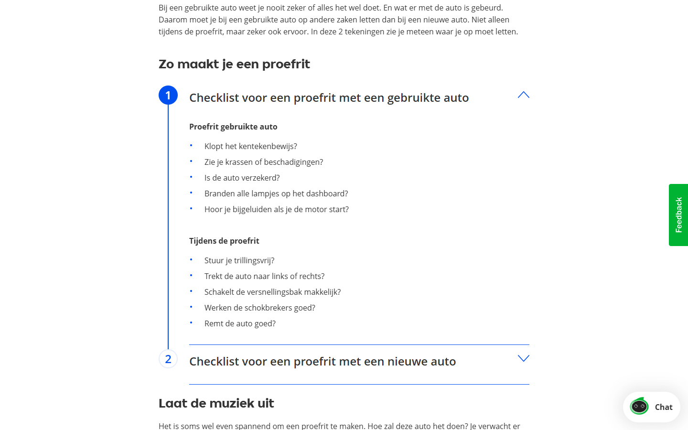
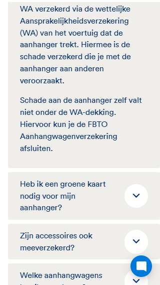
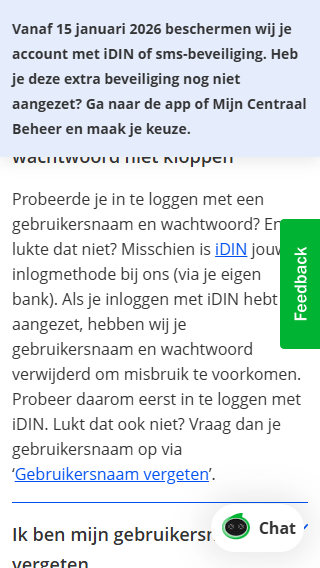

# Component Analysis: Accordion

> **Generated:** 2026-02-23
> **Brands:** FBTO, Centraal Beheer (CB)
> **Confirmed pairs:** 3 (fbto::Accordeon block ↔ fbto::Accordeon container, fbto::Accordeon container ↔ cb::Content accordion v1, fbto::Accordeon container ↔ cb::Focus accordion v1)
> **Agent:** deep-analysis / playwright-cli

---

## Executive Summary

All four named components are accordion-pattern UI elements serving the same user need: progressively disclosing content under a clickable heading. They can be unified into a single React `Accordion` component. Complexity is **medium**: the two brands use fundamentally different technical mechanisms (JS+ARIA vs CSS-only checkbox), the CB "Focus" variant adds a visual numbered-steps treatment, and FBTO embeds Schema.org FAQ markup — all of which are expressible as props and token overrides rather than separate codebases.

---

## Component Instances

| Brand | Name | Selector | Usage count | Sample URL |
|-------|------|----------|-------------|------------|
| FBTO | Accordeon block | `div.accordion__item` | 3,500 | https://www.fbto.nl/aanhangwagenverzekering |
| FBTO | Accordeon container | `div.accordion` | 631 | https://www.fbto.nl/aanhangwagenverzekering |
| CB | Content accordion v1 | `.strip.main-content.content-accordion` | 535 | https://www.centraalbeheer.nl/account/hulp-bij-inloggen |
| CB | Focus accordion v1 | `.strip.js-collapsable` | 196 | https://www.centraalbeheer.nl/artikelen/10-tips-proefrit-auto |

> **Note:** FBTO "Accordeon block" (item) and "Accordeon container" (wrapper) are the same component at different DOM levels — block = one item, container = the wrapping list. They are treated as a single component in this analysis.

---

## Gathered Data

### FBTO — Desktop (1440px, collapsed)



### FBTO — Desktop (1440px, first item expanded)



### CB — Content Accordion v1 (1440px)



### CB — Focus Accordion v1 / ordered-steps variant (1440px)



### Mobile (320px)

| FBTO | CB |
|------|----|
|  |  |

### Artifact index

| File | Description |
|------|-------------|
| `gathered/fbto-accordion.html` | Full outerHTML — FBTO |
| `gathered/fbto-accordion-skeleton.html` | Class-stripped skeleton — FBTO |
| `gathered/fbto-accordion-styles.json` | Computed styles — FBTO |
| `gathered/fbto-accordion-interactions.json` | Interactions — FBTO |
| `gathered/cb-content-accordion.html` | Full outerHTML — CB Content accordion |
| `gathered/cb-content-accordion-skeleton.html` | Class-stripped skeleton — CB |
| `gathered/cb-content-accordion-styles.json` | Computed styles — CB |
| `gathered/cb-content-accordion-interactions.json` | Interactions — CB |

---

## Structure Analysis

### DOM hierarchy comparison

```
FBTO
└── div.accordion                           ← container, display:flex flex-col
    └── div.accordion__item [×N]            ← card, bg:warm-gray, border-radius:3px
        ├── div.accordion__question
        │   ├── h3 > button[aria-expanded]  ← trigger, font-weight:900
        │   └── div.accordion__item-icon
        │       └── i.icon-rf-chevron-down  ← icon font, aria-hidden
        └── div.accordion__answer           ← panel, max-height anim, overflow:hidden
            └── div.cms-content-wrapper
                └── [rich CMS content]

CB Content accordion v1
└── article.strip.content-accordion         ← section wrapper
    └── div.container > div.row > div.col
        └── div.main-content__content
            ├── h2.title-large              ← section heading
            ├── div.content-text            ← optional intro paragraph
            └── div.collapsable [×N]        ← no card styling, white bg
                ├── input[type=checkbox].visually-hidden  ← CSS toggle mechanism
                ├── label.collapsable__header             ← trigger
                │   ├── h3.title-small
                │   └── span.icon > svg                  ← inline SVG chevron
                └── div.collapsable__content              ← panel, max-height anim
                    └── div.content-text

CB Focus accordion v1 (ordered-steps variant)
└── article.strip.ordered-collapsable.ordered-collapsable--steps
    └── ...same inner structure as Content accordion...
        ← adds numbered circle (::before counter) and vertical connector line (::after)
        ← heading uses h3.title-medium (larger than content-accordion's title-small)
```

### Semantic elements audit

| Element | FBTO | CB |
|---------|------|----|
| Container tag | `<div>` | `<article>` |
| Item tag | `<div>` | `<div>` |
| Trigger tag | `<button>` | `<label>` (with hidden `<input>`) |
| Heading in trigger | `<h3>` wrapping button | `<h3>` inside label |
| Panel tag | `<div>` | `<div>` |
| Icon | Icon font `<i>` | Inline `<svg>` |

### ARIA attributes

| Attribute | FBTO | CB |
|-----------|------|----|
| `aria-expanded` on trigger | ✅ present, JS-managed | ❌ absent |
| `aria-controls` on trigger | ❌ absent | ❌ absent |
| `role="region"` on panel | ❌ absent | ❌ absent |
| `aria-labelledby` on panel | ❌ absent | ❌ absent |
| `aria-hidden` on icon | ✅ on `<i>` | ✅ on SVG (`aria-hidden="true"`) |
| `itemprop` attributes | ✅ schema.org FAQ | ❌ absent |

### Content slots identified

| Slot | FBTO | CB |
|------|------|----|
| Section heading | External (h2 above component) | `h2.title-large` inside article |
| Intro text | External (separate component) | `div.content-text` before items |
| Item trigger | `itemprop="name"` on button | `h3.title-small` inside label |
| Item panel | `div.cms-content-wrapper` | `div.content-text` |
| Step number | ❌ absent | ✅ CSS counter (Focus variant only) |

---

## Styling Analysis

### Token mapping table

| Property | Component token | Semantic token | FBTO value | CB value |
|----------|-----------------|----------------|------------|---------|
| Item background | `--accordion-item-bg` | `--surface-secondary` | `rgb(239,238,235)` — warm gray | `rgb(255,255,255)` — white |
| Text color | `--accordion-text` | `--text-primary` | `rgb(0,43,102)` — navy | `rgb(51,51,51)` — near-black |
| Trigger font weight | `--accordion-trigger-weight` | *(component only)* | `900` (black) | `400` (regular, heading carries weight) |
| Font family | — | `--font-family-base` | `circular, Helvetica Neue, Arial` | `OpenSans, Arial` |
| Font size (trigger) | — | `--text-md` | `~17.4px` | `16px` + heading class |
| Item padding | `--accordion-item-padding` | `--spacing-4 --spacing-6` | `~15px 30px` | `16px 32px 16px 0` (header only) |
| Item gap / margin | `--accordion-item-gap` | `--spacing-3` | `10.77px bottom margin` | `0` (border-bottom used) |
| Border radius | `--accordion-radius` | `--radius-sm` | `3px` | `0px` |
| Icon color | `--accordion-icon-color` | `--text-secondary` | `rgb(0,43,102)` (same as text) | CB navy blue |
| Animation duration | `--accordion-duration` | `--duration-normal` | `300ms` | `300ms` |
| Step number color | `--accordion-step-color` | `--interactive-bg` | N/A | `#003882` (dark blue circle) |
| Step connector color | `--accordion-step-line` | `--border-default` | N/A | `#003882` |

### Responsive behavior

| Breakpoint | FBTO | CB |
|------------|------|-----|
| 1440px | Two-column layout (sidebar + content), accordion in right column | Full-width article, 7-col grid |
| 768px | Single column, accordion spans full width | Stacks to single column |
| 320px | Full width, items stack cleanly, chevron right-aligned | Full width, items stack cleanly |

No visual differences in the accordion items themselves at mobile vs desktop — the containing grid collapses but item layout is unchanged.

### CSS class naming convention

- **FBTO**: BEM — `.accordion__item`, `.accordion__question`, `.accordion__answer`, `.accordion__item-icon`
- **CB**: BEM + modifier pattern — `.collapsable`, `.collapsable--arrow`, `.collapsable--blue-arrow`, `.collapsable--animated`, `.collapsable__header`, `.collapsable__content`, `.collapsable__input`; outer strip uses descriptive classes (`.content-accordion`, `.ordered-collapsable--steps`)

---

## Interaction Analysis

### State machine

```
         ┌─────────────┐
         │  collapsed  │ ◄──── default state
         └──────┬──────┘
                │ click trigger / Space (FBTO) / Space (CB checkbox)
                ▼
         ┌─────────────┐
         │  expanded   │ ──── panel visible, icon rotated 180°
         └──────┬──────┘
                │ click trigger again
                ▼
         ┌─────────────┐
         │  collapsed  │
         └─────────────┘
```

### Behavior comparison

| Behavior | FBTO | CB Content | CB Focus |
|----------|------|------------|----------|
| Multiple open simultaneously | ✅ yes | Per-group: ❌ radio-like (same `name` = one open) | Same as CB Content |
| Animation on open | max-height + opacity, 300ms | max-height, 300ms | Same as CB Content |
| Animation on close | Reverse (cubic-bezier) | Reverse | Same |
| `prefers-reduced-motion` | ❌ not respected | ❌ not respected | ❌ not respected |
| Focus after toggle | Stays on trigger button | Stays on checkbox | Same as CB Content |
| First item open by default | ❌ no | Sometimes ✅ (CMS-controlled via `checked` attr) | Sometimes ✅ |
| JS dependency | ✅ required (toggle + aria) | ❌ CSS-only (checkbox hack) | ❌ CSS-only |

### Framework dependencies

| Brand | JS framework | Component library |
|-------|-------------|------------------|
| FBTO | Vanilla JS (likely Angular or Vue wrapping) | Custom, no third-party accordion library detected |
| CB | No JS required for open/close — CSS-only | Custom checkbox pattern |

---

## Accessibility Audit

### ARIA comparison

| Attribute | FBTO | CB Content | CB Focus | WAI-ARIA spec |
|-----------|------|------------|----------|---------------|
| `role` on trigger | implicit `button` (from `<button>`) | `checkbox` (from `<input>`) | `checkbox` | Should be `button` |
| `aria-expanded` | ✅ present | ❌ absent | ❌ absent | Required on trigger |
| `aria-controls` | ❌ absent | ❌ absent | ❌ absent | Required — refs panel ID |
| `role="region"` on panel | ❌ absent | ❌ absent | ❌ absent | Recommended for landmark |
| `aria-labelledby` on panel | ❌ absent | ❌ absent | ❌ absent | Required with role=region |
| Focus management | ✅ logical (button sequence) | ⚠️ checkbox (confusing semantics) | ⚠️ checkbox | Must stay on trigger |
| Keyboard: Enter | ✅ toggles | ❌ may not toggle (checkbox label) | ❌ same | Must toggle |
| Keyboard: Space | ✅ toggles | ✅ toggles checkbox | ✅ same | Must toggle |
| Keyboard: Arrow keys | ❌ not implemented | ❌ not implemented | ❌ not implemented | Optional per ARIA spec |

### Violations

| Rule | Severity | Brand | Recommendation |
|------|----------|-------|----------------|
| Missing `aria-controls` on trigger | Serious | FBTO | Add `aria-controls="panel-[id]"` to each button |
| Missing `role="region"` + `aria-labelledby` on panel | Moderate | FBTO | Add `id`, `role="region"`, `aria-labelledby` to `.accordion__answer` |
| `input[type=checkbox]` used as disclosure trigger | Serious | CB | Replace with `<button aria-expanded>` pattern |
| No `aria-expanded` state | Serious | CB | Screen readers cannot announce open/closed state |
| `prefers-reduced-motion` not respected | Moderate | Both | Wrap animation in `@media (prefers-reduced-motion: no-preference)` |
| No `aria-controls` | Serious | CB | Same as FBTO |
| Icon font without accessible alternative | Minor | FBTO | `aria-hidden="true"` is present — acceptable |

### Focus indicator

- **FBTO**: Browser default outline on button — visible but not brand-styled
- **CB**: Browser default outline on checkbox — very small target, visually confusing

### Color contrast

| Element | FBTO | Ratio | CB | Ratio | WCAG AA |
|---------|------|-------|----|-------|---------|
| Trigger text | navy `#002B66` on warm-gray `#EFEEEB` | ~9:1 ✅ | dark `#333333` on white | ~12:1 ✅ | 4.5:1 |
| Answer text | navy on warm-gray | ~9:1 ✅ | dark on white | ~12:1 ✅ | 4.5:1 |

---

## SEO & Content

### Heading hierarchy

- **FBTO**: H2 section title ("Veelgestelde vragen") → H3 per accordion question. Correct hierarchy. ✅
- **CB Content**: H1 page title → H2 section heading → H3 per item. Correct. ✅
- **CB Focus (steps)**: Same hierarchy — H2 section → H3 per step. Correct. ✅

### Structured data opportunities

- **FBTO already implements `FAQPage` / `Question` / `Answer` schema.org microdata** — this is excellent for Google FAQ rich results and should be preserved in the new component.
- **CB has no structured data** — FAQPage schema should be added to CB content accordion instances when the content is Q&A format. For article/steps (Focus variant), `HowTo` schema is applicable.

### Indexability of collapsed content

- **FBTO**: Collapsed content is in the DOM with `display:block` and `overflow:hidden` via max-height. Google indexes hidden accordion content. ✅
- **CB**: Same — `overflow:hidden` with CSS max-height; content is in the DOM. ✅

### GEO readiness

| Criterion | FBTO | CB |
|-----------|------|----|
| Clear entity/topic labels | ✅ (itemprop names) | ⚠️ (plain text headings) |
| Question-answer patterns | ✅ (FAQ items) | ✅ (content accordion) |
| Concise summaries | ✅ (button text = question) | ✅ (h3 = clear topic) |
| Structured lists | ✅ (schema.org) | ❌ (no structured data) |

---

## Performance

| Metric | FBTO | CB | Target |
|--------|------|----|--------|
| CLS contribution | Low — items have fixed height before expand | Low — `--max-height` CSS var prevents shift | < 0.1 |
| LCP candidate? | No — below fold, text-only | No — below fold | — |
| JS bundle size | Small — vanilla toggle script; no library | Zero for open/close — CSS only | minimal |
| Images lazy-loaded? | No images in component | No images in component | yes |
| Render blocking | No | No | no |

---

## Similarities

- Both accordion components progressively reveal/hide a text panel on user interaction
- Both use a chevron/arrow icon that rotates 180° on expand
- Both animate with a 300ms `max-height` transition
- Both use `<h3>` for item titles (inside the trigger)
- Both are fully visible/indexable in the DOM when collapsed (SEO-safe)
- Both brands place the accordion inside a wider page section with a contextual heading
- Both support an arbitrary number of items per group
- Text content in panels on both brands consists of rich CMS HTML (paragraphs, lists, links)
- Neither brand respects `prefers-reduced-motion`
- Neither brand implements arrow-key navigation between items

---

## Differences

### Category A — Design Tokens

| Difference | Component token | Semantic token | FBTO value | CB value |
|------------|-----------------|----------------|------------|---------|
| Item background | `--accordion-item-bg` | `--surface-secondary` | `#EFEEEB` (warm gray) | `#FFFFFF` (white) |
| Text / trigger color | `--accordion-text` | `--text-primary` | `#002B66` (navy) | `#333333` (near-black) |
| Trigger font weight | `--accordion-trigger-weight` | *(component-only)* | `900` | `400` (heading provides weight) |
| Font family | — | `--font-family-base` | `circular` | `OpenSans` |
| Item padding | `--accordion-item-padding` | `--spacing-4 --spacing-6` | `15px 30px` | `16px 32px 16px 0` |
| Item gap | `--accordion-item-gap` | `--spacing-3` | `~11px` bottom margin | `0` (divider instead) |
| Border radius | `--accordion-radius` | `--radius-sm` | `3px` | `0px` |
| Animation easing | `--accordion-easing` | `--easing-default` | `cubic-bezier(0,1,0,1)` | `ease` |
| Step circle color | `--accordion-step-bg` | `--interactive-bg` | N/A | `#003882` |

### Category B — Component Props

| Difference | Prop name | Type | Default | FBTO | CB |
|------------|-----------|------|---------|------|----|
| Allow multiple items open | `allowMultiple` | `boolean` | `false` | `true` | `false` (per group) |
| Show section heading inside component | `sectionHeading` | `string \| null` | `null` | External | Internal (`h2`) |
| Show intro text above items | `introText` | `ReactNode \| null` | `null` | No | Yes (CMS) |
| Apply FAQ schema.org markup | `schemaFaq` | `boolean` | `false` | `true` | `false` |
| Variant — ordered steps | `variant` | `'default' \| 'steps'` | `'default'` | N/A | `'steps'` (Focus variant) |
| First item open by default | `defaultOpenIndex` | `number \| null` | `null` | Not used | CMS-controlled |
| Item panel content | `items[].answer` | `ReactNode` | required | `div.cms-content-wrapper` | `div.content-text` |

### Category C — Structural Divergence

| # | Description | Impact | Risk | Resolution |
|---|-------------|--------|------|------------|
| 1 | **Toggle mechanism** — FBTO uses `<button>` + JS `aria-expanded`; CB uses `<input[type=checkbox]>` + CSS. These are incompatible patterns. | High — behavior, a11y, and SSR all affected | High | **Use `<button>` + JS for React** — the checkbox hack is a CSS-only workaround for legacy HTML; React components should use the WAI-ARIA Accordion pattern with `aria-expanded` |
| 2 | **CB Focus accordion adds numbered circles + vertical connector** — this is a pure CSS visual variant using CSS counters and pseudo-elements. The underlying markup is identical to content accordion. | Medium — visual only | Low | Add `variant="steps"` prop that applies CSS class enabling the counter/connector styling via token overrides |
| 3 | **Schema.org microdata** — FBTO embeds `itemscope`/`itemprop` directly in HTML; CB has none. In React, this is expressed via HTML attributes but requires CMS field alignment. | Medium — SEO/GEO | Medium | `schemaFaq` prop outputs `itemScope`, `itemType`, `itemProp` attributes when `true`; CMS for CB must be updated to mark applicable accordions as FAQ type |

---

## Unified Component Design

### Name & Composition

**Proposed name:** `Accordion`

**Sub-components:**

```
<Accordion>                          ← manages state, provides context
  <AccordionSection>                 ← optional: groups items with heading + intro
    <AccordionItem>                  ← one collapsible unit
      <AccordionTrigger>             ← button with aria-expanded
      <AccordionPanel>               ← animated region
```

For simple usage without sections, `AccordionSection` is optional and `Accordion` → `AccordionItem` works directly.

### Props Interface

```typescript
interface AccordionProps {
  /** Allow multiple items open simultaneously. Default: false */
  allowMultiple?: boolean;
  /** Visual variant. 'steps' adds numbered circles + connector. Default: 'default' */
  variant?: 'default' | 'steps';
  /** Apply schema.org FAQPage microdata. Default: false */
  schemaFaq?: boolean;
  /** Controlled: array of open item IDs */
  openItems?: string[];
  /** Callback when items change */
  onOpenChange?: (openItems: string[]) => void;
  className?: string;
  children: React.ReactNode;
}

interface AccordionSectionProps {
  heading?: string;
  headingLevel?: 2 | 3 | 4;
  introText?: React.ReactNode;
  children: React.ReactNode;
}

interface AccordionItemProps {
  id: string;
  /** Initial open state when uncontrolled. Default: false */
  defaultOpen?: boolean;
  children: React.ReactNode;
}

interface AccordionTriggerProps {
  children: React.ReactNode;
  /** schema.org itemprop="name" applied when schemaFaq=true */
  className?: string;
}

interface AccordionPanelProps {
  children: React.ReactNode;
  /** schema.org Answer itemscope applied when schemaFaq=true */
  className?: string;
}
```

### Design Tokens

```css
/* Tier 1 — Global tokens (per brand theme) */
--color-primary-fbto: #002B66;
--color-primary-cb: #003882;
--color-neutral-50-fbto: #EFEEEB;  /* warm gray */
--color-neutral-50-cb: #FFFFFF;
--color-text-fbto: #002B66;
--color-text-cb: #333333;
--font-family-fbto: circular, 'Helvetica Neue', Arial, sans-serif;
--font-family-cb: OpenSans, Arial, sans-serif;
--spacing-3: 0.75rem;   /* 12px */
--spacing-4: 1rem;      /* 16px */
--spacing-6: 1.5rem;    /* 24px */
--radius-sm: 4px;
--duration-normal: 300ms;
--easing-accordion: cubic-bezier(0, 1, 0, 1);

/* Tier 2 — Semantic tokens */
--surface-secondary: var(--color-neutral-50);
--text-primary: var(--color-text);
--font-family-base: var(--font-family);
--interactive-bg: var(--color-primary);
--focus-ring: var(--color-primary);

/* Tier 3 — Component tokens */
--accordion-item-bg: var(--surface-secondary);
--accordion-text: var(--text-primary);
--accordion-trigger-weight: 700;           /* compromise — both brands get bold trigger */
--accordion-item-padding: var(--spacing-4) var(--spacing-6);
--accordion-item-gap: var(--spacing-3);
--accordion-radius: var(--radius-sm);
--accordion-duration: var(--duration-normal);
--accordion-easing: var(--easing-accordion);
--accordion-icon-color: var(--text-primary);
--accordion-step-bg: var(--interactive-bg);
--accordion-step-line: var(--interactive-bg);
--accordion-focus-ring: var(--focus-ring);
```

### Semantic HTML

```html
<!-- Default FAQ usage (FBTO style, schemaFaq=true) -->
<div class="accordion" role="list">
  <div class="accordion__item" role="listitem"
       itemscope itemtype="https://schema.org/Question" itemprop="mainEntity">
    <h3 class="accordion__heading">
      <button
        type="button"
        class="accordion__trigger"
        aria-expanded="false"
        aria-controls="panel-1"
        itemprop="name"
      >
        Ben ik verplicht om mijn aanhangwagen te verzekeren?
      </button>
    </h3>
    <div
      id="panel-1"
      role="region"
      aria-labelledby="trigger-1"
      class="accordion__panel"
      hidden
      itemscope itemtype="https://schema.org/Answer" itemprop="acceptedAnswer"
    >
      <div class="accordion__panel-inner" itemprop="text">
        <p>Nee, je bent niet verplicht…</p>
      </div>
    </div>
  </div>
</div>

<!-- Steps variant (CB Focus style, variant="steps") -->
<div class="accordion accordion--steps">
  <div class="accordion__item">
    <h3 class="accordion__heading">
      <button type="button" class="accordion__trigger" aria-expanded="true" aria-controls="panel-s1">
        Checklist voor een proefrit met een gebruikte auto
      </button>
    </h3>
    <div id="panel-s1" role="region" aria-labelledby="trigger-s1" class="accordion__panel">
      <div class="accordion__panel-inner">
        <ul>…</ul>
      </div>
    </div>
  </div>
</div>
```

### Structured Data

For FAQ-type accordions (`schemaFaq={true}`), output `FAQPage` JSON-LD in addition to microdata:

```json
{
  "@context": "https://schema.org",
  "@type": "FAQPage",
  "mainEntity": [
    {
      "@type": "Question",
      "name": "Ben ik verplicht om mijn aanhangwagen te verzekeren?",
      "acceptedAnswer": {
        "@type": "Answer",
        "text": "Nee, je bent niet verplicht..."
      }
    }
  ]
}
```

For steps/how-to accordions (`variant="steps"` with appropriate content), output `HowTo` JSON-LD:

```json
{
  "@context": "https://schema.org",
  "@type": "HowTo",
  "name": "Zo maakt je een proefrit",
  "step": [
    {
      "@type": "HowToStep",
      "name": "Checklist voor een proefrit met een gebruikte auto",
      "text": "..."
    }
  ]
}
```

---

## Migration

| Dimension | FBTO | CB |
|-----------|------|----|
| Pages affected | 3,500 block instances / 631 container instances | 535 content + 196 focus instances |
| JS framework replaced | Vanilla JS toggle (likely Angular/Vue directive wrapper) | No JS — CSS checkbox hack |
| Re-authoring effort | Low — same field structure (question/answer) | Low — same structure; add `schemaFaq` flag to FAQ instances |
| Rollback strategy | Keep old Angular/Vue components as fallback behind feature flag | Keep old CSS classes; new component outputs same semantic HTML |

### CMS Field Mapping

| FBTO field | CB field | Unified prop |
|------------|----------|--------------|
| `itemprop="name"` (button text) | h3 text in label | `items[].trigger` (string) |
| `div.cms-content-wrapper` content | `div.content-text` content | `items[].panel` (rich text / ReactNode) |
| FAQPage schema enabled | Not present | `schemaFaq` (boolean) — add to CB CMS template |
| Not present | `checked` attribute on input (default open) | `items[].defaultOpen` (boolean) |
| Not present | `name` attribute grouping | `groupName` or managed by `allowMultiple` prop |
| Not present | Ordered steps variant class | `variant` (enum) — add to CB CMS template |

### Analytics Event Mapping

| Event | FBTO | CB | Unified |
|-------|------|----|---------|
| Item open | Not confirmed (likely dataLayer push) | Not confirmed | `onOpenChange(id, 'open')` → `dataLayer.push({ event: 'accordion_open', label: triggerText })` |
| Item close | Not confirmed | Not confirmed | `onOpenChange(id, 'close')` → `dataLayer.push({ event: 'accordion_close', label: triggerText })` |

---

## Open Questions

1. **Schema.org scope**: Which CB content accordion instances should get `schemaFaq=true`? Needs CMS content audit — not all CB accordions are Q&A format (some are step-lists, some are help articles).
2. **Multi-open default**: CB currently allows only one item open per group (radio-like). Should the unified component default to `allowMultiple=false` to match CB, or `true` to match FBTO? Recommend defaulting to `false` (more common UX pattern) with FBTO templates passing `allowMultiple={true}`.
3. **Arrow key navigation**: WAI-ARIA spec defines optional arrow-key navigation between accordion headers. Should this be implemented? It benefits keyboard/AT users but is not currently present on either brand. Recommend implementing as it is listed as a best practice.
4. **CB `--max-height` CSS variable**: The current CB implementation requires the server to inject `style="--max-height: Npx"` on each panel. React removes this need (JS manages height), but this must be confirmed with the team as it affects SSR/hydration.
5. **HowTo schema for Focus accordion**: Which step-accordion instances qualify for `HowTo` markup? Needs CMS content classification.
6. **Transition easing alignment**: FBTO uses `cubic-bezier(0,1,0,1)` which creates an overshoot-style easing. CB uses `ease`. Design system decision needed for a single `--easing-accordion` value.
